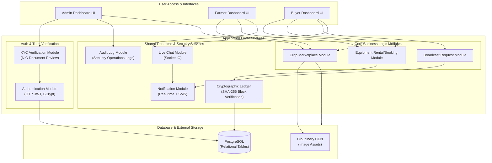
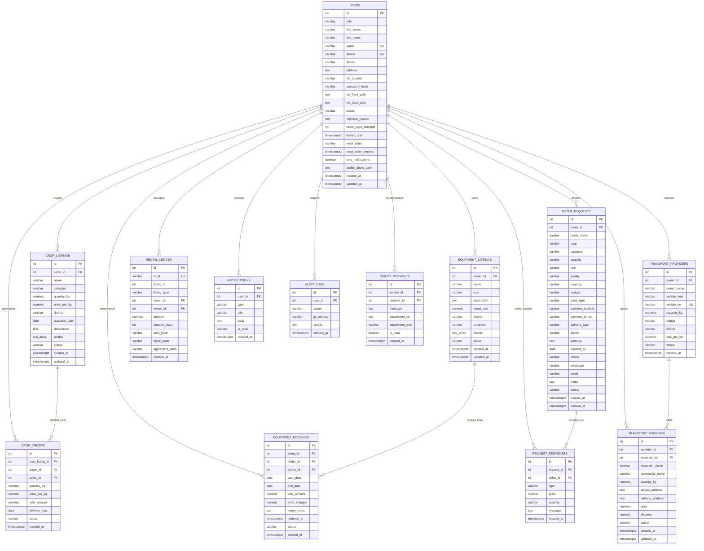
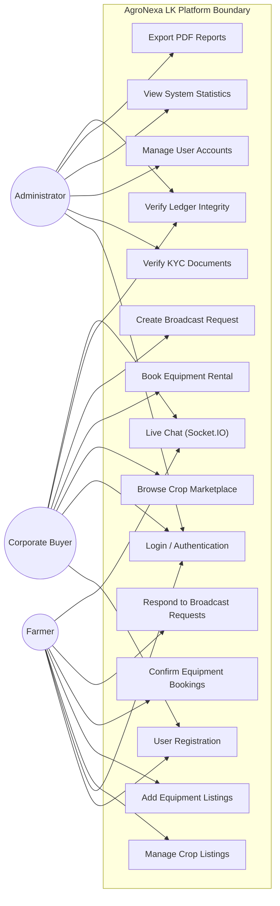
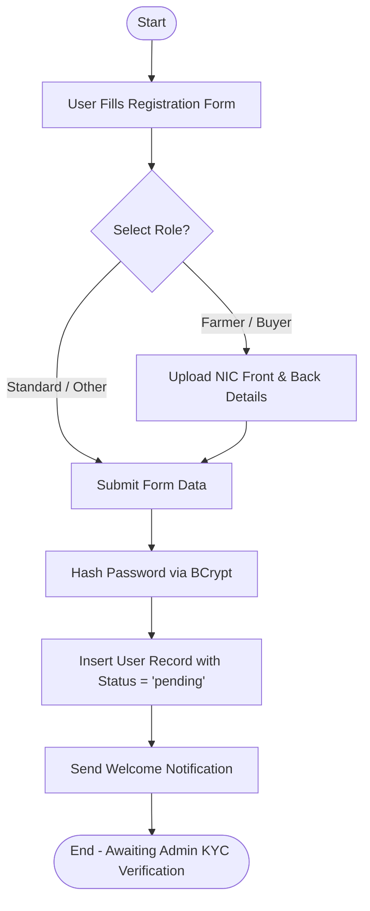
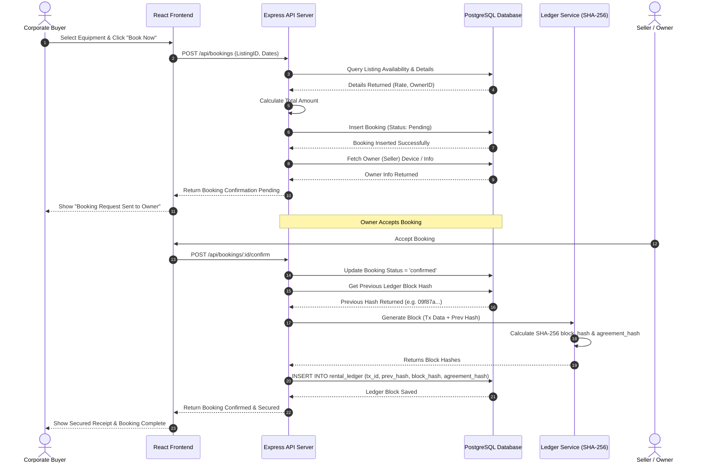
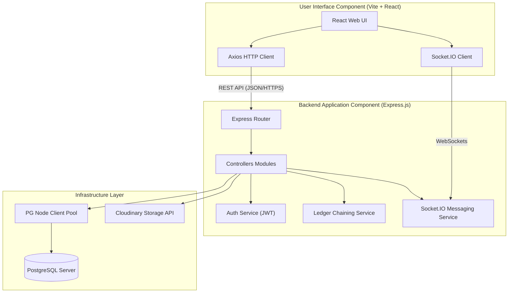
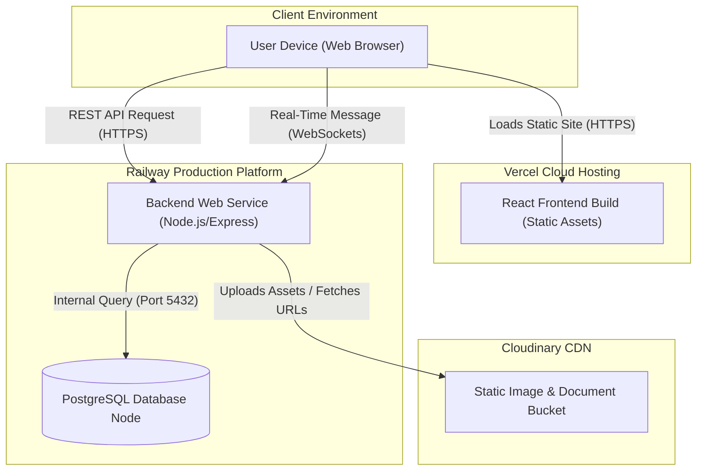
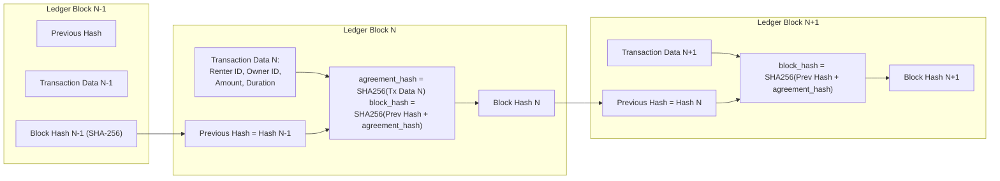

# CHAPTER 4 – SYSTEM DESIGN

## 4.1 Introduction

System design is the process of transforming system requirements into a structured architecture that defines how the software components interact to achieve the project objectives. A well-designed architecture improves system reliability, scalability, maintainability, and security while simplifying future enhancements.

The AgroNexa LK Smart Farming Platform was designed using a modular three-tier architecture consisting of the presentation layer, application layer, and database layer. Each module performs a specific responsibility while communicating securely with the others through RESTful APIs and real-time communication services.

The system design emphasizes secure authentication, role-based authorization, modular implementation, data integrity, scalability, and user-friendly interaction.

---

## 4.2 Overall System Architecture

The AgroNexa LK platform follows a three-tier client-server architecture.

### Presentation Layer
The presentation layer consists of the React.js web application accessed through modern web browsers. This layer provides interfaces for administrators, farmers, and corporate buyers. It includes user registration, login, dashboards, marketplace browsing, equipment rental, live chat, and administrative functions.

### Application Layer
The application layer is implemented using Node.js and Express.js. It processes client requests, validates user input, performs authentication, executes business logic, communicates with external services, and interacts with the PostgreSQL database.

Major modules include:
* Authentication Module
* KYC Management Module
* Marketplace Module
* Equipment Rental Module
* Broadcast Request Module
* Notification Module
* Live Chat Module
* Cryptographic Ledger Module
* Audit Log Module
* Administration Module

### Database Layer
The database layer uses PostgreSQL to securely store user accounts, crop listings, equipment information, booking records, messages, notifications, audit logs, and cryptographic ledger blocks.

**Figure 4.1: Overall System Architecture**

```mermaid
graph TD
    %% Presentation Layer
    subgraph Presentation_Layer["Presentation Layer (Client-Side)"]
        Browser["Web Browser (React.js + Tailwind CSS)"]
        UI_Buyer["Buyer Dashboard View"]
        UI_Seller["Seller Dashboard View"]
        UI_Admin["Admin Panel View"]
        Browser --> UI_Buyer
        Browser --> UI_Seller
        Browser --> UI_Admin
    end

    %% Application Layer
    subgraph Application_Layer["Application Layer (Server-Side)"]
        API_Gateway["Express.js Server (Node.js)"]
        Auth_Mod["Auth Module (JWT & BCrypt)"]
        Market_Mod["Marketplace & Orders Module"]
        Rental_Mod["Equipment Rental Module"]
        Broadcast_Mod["Broadcast Request Module"]
        Ledger_Mod["Cryptographic Ledger Module"]
        Chat_Mod["Live Chat (Socket.IO)"]
        Audit_Mod["Audit Logging Service"]

        API_Gateway --> Auth_Mod
        API_Gateway --> Market_Mod
        API_Gateway --> Rental_Mod
        API_Gateway --> Broadcast_Mod
        API_Gateway --> Ledger_Mod
        API_Gateway --> Chat_Mod
        API_Gateway --> Audit_Mod
    end

    %% Database & External Layer
    subgraph Database_Layer["Database & Storage Layer"]
        DB[("PostgreSQL Database")]
        Cloudinary["Cloudinary Storage (Images/KYC)"]
    end

    %% Connections
    Browser -- "HTTPS (REST APIs)" --> API_Gateway
    Browser -- "WebSocket (Real-time)" --> Chat_Mod
    Application_Layer -- "SQL Queries" --> DB
    API_Gateway -- "Upload Documents/Photos" --> Cloudinary
```

---

## 4.3 System Modules

The AgroNexa LK platform consists of several independent but interconnected software modules.

### Authentication Module
Provides OTP verification, JWT authentication, password hashing, user login, logout, and session management.

### KYC Verification Module
Allows users to upload National Identity Card (NIC) images. Administrators manually verify the documents before activating user accounts.

### Crop Marketplace Module
Allows farmers to publish agricultural products with descriptions, prices, quantities, photographs, and geographical locations.

### Equipment Rental Module
Allows farmers to advertise agricultural machinery while enabling buyers to submit rental requests.

### Broadcast Request Module
Allows buyers to publish large-scale procurement requirements targeted at selected districts.

### Notification Module
Generates real-time notifications for approvals, booking requests, chat messages, and broadcast responses.

### Live Chat Module
Uses Socket.IO to facilitate instant communication between buyers and farmers.

### Cryptographic Ledger Module
Generates SHA-256 hash chains whenever rental bookings are confirmed, ensuring transaction integrity.

### Administration Module
Provides dashboard analytics, KYC approvals, user management, audit monitoring, report generation, and ledger verification.

**Figure 4.9: System Modules Design**

---

## 4.4 Database Design

The AgroNexa LK platform uses PostgreSQL as its relational database management system.

The database stores information related to:
* Users
* User Roles
* Crop Listings
* Equipment Listings
* Equipment Bookings
* Broadcast Requests
* Buyer Responses
* Messages
* Notifications
* Audit Logs
* Rental Ledger

Primary keys uniquely identify records, while foreign keys establish relationships among tables to ensure referential integrity.

**Figure 4.2: Entity Relationship Diagram (ER Diagram)**

---

## 4.5 Database Schema

The primary database tables are:

| Table         | Purpose                      |
| ------------- | ---------------------------- |
| users         | Stores user information      |
| crop_listings | Stores agricultural products |
| equipment     | Stores rental equipment      |
| bookings      | Stores equipment bookings    |
| broadcasts    | Buyer procurement requests   |
| responses     | Farmer responses             |
| messages      | Live chat messages           |
| notifications | System notifications         |
| audit_logs    | User activity logs           |
| rental_ledger | SHA-256 transaction records  |

---

## 4.6 Use Case Diagram

The system supports three user roles:

### Administrator
* Login
* Verify KYC
* Manage Users
* View Statistics
* Export Reports
* Verify Ledger

### Farmer
* Register
* Login
* Add Crop Listing
* Edit Listing
* Delete Listing
* Add Equipment
* Confirm Bookings
* Respond to Broadcasts
* Chat

### Corporate Buyer
* Register
* Login
* Browse Marketplace
* Express Interest
* Create Broadcast
* Book Equipment
* Verify Ledger
* Chat

**Figure 4.3: Use Case Diagram**

---

## 4.7 Activity Diagrams

Activity diagrams illustrate the workflow of major business processes.

The following activity diagrams are included:
* User Registration
* KYC Approval
* Crop Publishing
* Equipment Booking
* Broadcast Request
* Ledger Verification

**Figure 4.4: User Registration Activity Diagram**

---

## 4.8 Sequence Diagrams

Sequence diagrams describe interactions among users, frontend, backend services, and database.

Major sequence diagrams include:
* User Login
* Crop Publishing
* Equipment Booking
* Broadcast Request
* Chat Communication
* Ledger Generation

**Figure 4.5: Equipment Booking Sequence Diagram**

---

## 4.9 Component Diagram

The AgroNexa LK system consists of the following components:
* React Frontend
* Authentication API
* Marketplace API
* Booking API
* Notification Service
* Socket.IO Server
* Ledger Service
* PostgreSQL Database
* Cloudinary Storage

These components interact through REST APIs and WebSocket communication.

**Figure 4.6: Component Diagram**

---

## 4.10 Deployment Architecture

The deployment architecture separates the frontend, backend, and database services.

### Frontend
Hosted on Vercel.

### Backend
Hosted on Railway.

### Database
PostgreSQL hosted on Railway.

### Cloud Storage
Cloudinary stores uploaded crop images and KYC documents.

### Communication
REST API over HTTPS and Socket.IO for real-time communication.

**Figure 4.7: Deployment Diagram**

---

## 4.11 Security Architecture

The AgroNexa LK platform incorporates multiple security mechanisms.
* OTP Verification
* JWT Authentication
* Password Hashing
* Role-Based Access Control (RBAC)
* KYC Verification
* HTTPS Communication
* SQL Injection Prevention
* Input Validation
* Audit Logging
* Cryptographic Ledger Verification

These mechanisms collectively improve system confidentiality, integrity, and availability.

---

## 4.12 Cryptographic Ledger Design

One of the unique features of AgroNexa LK is the blockchain-inspired cryptographic ledger.

Whenever an equipment rental booking is confirmed:
1. Booking information is collected.
2. The previous block hash is retrieved.
3. A new SHA-256 hash is generated.
4. The new block is stored in the **rental_ledger** table.
5. During verification, all hashes are recalculated to detect unauthorized modifications.

This mechanism provides immutable transaction verification without implementing a decentralized blockchain network.

**Figure 4.8: Cryptographic Ledger Workflow**

---

## 4.13 User Interface Design

The user interface was designed according to modern web usability principles.

Main interfaces include:
* Landing Page
* Registration Page
* Login Page
* Farmer Dashboard
* Buyer Dashboard
* Administrator Dashboard
* Marketplace
* Equipment Rental
* Broadcast Request
* Live Chat
* Ledger Verification

Each interface follows a responsive design compatible with desktops, tablets, and smartphones.

### Low-Fidelity UI Layouts

Below are the wireframe structures representing the interface layouts before high-fidelity visual assets are integrated.

#### User Login Wireframe
The login interface incorporates a split two-column design focusing on user entry credentials and tab selection.

#### Register and Seller Register Wireframes
Split interfaces with fields to choose role paths and optionally submit registration details alongside NIC verification uploads.

#### Buyer Dashboard Wireframe
Shows the structural widgets layout for crop listings searching, direct purchasing, and broadcasting.

#### Farmer / Seller Dashboard Wireframe
Structured panels displaying crop listings table, analytics overview charts, and ledger ledger transactions.

#### Administrator Panel Wireframe
Administrative module structure showing verification approvals pipelines and system logs views.

---

## 4.14 Chapter Summary

This chapter presented the overall system design of the AgroNexa LK Smart Farming Platform. It described the three-tier architecture, software modules, database design, UML diagrams, deployment architecture, security mechanisms, and the blockchain-inspired cryptographic ledger. The design provides a scalable, secure, and maintainable foundation for the implementation discussed in the next chapter.
