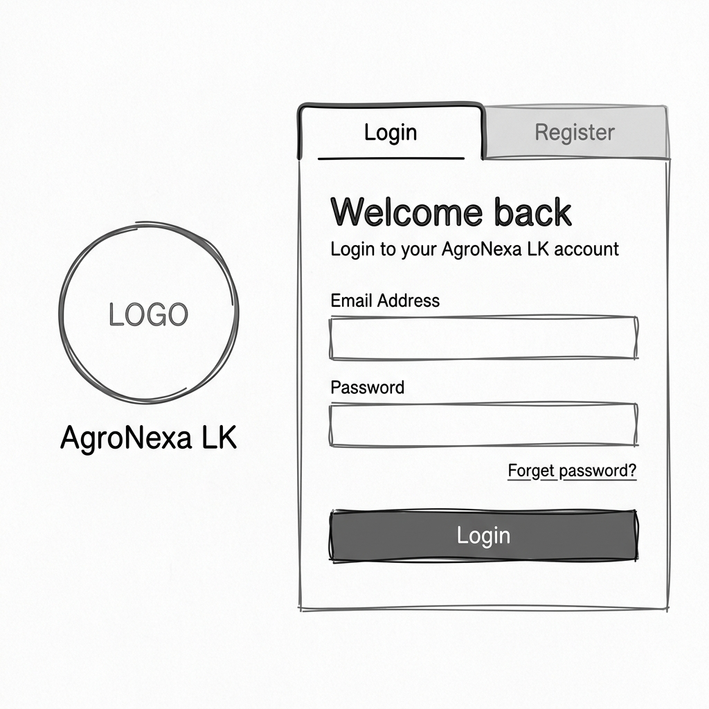
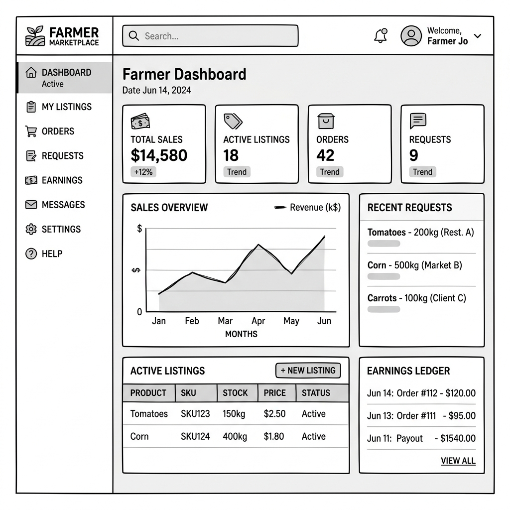
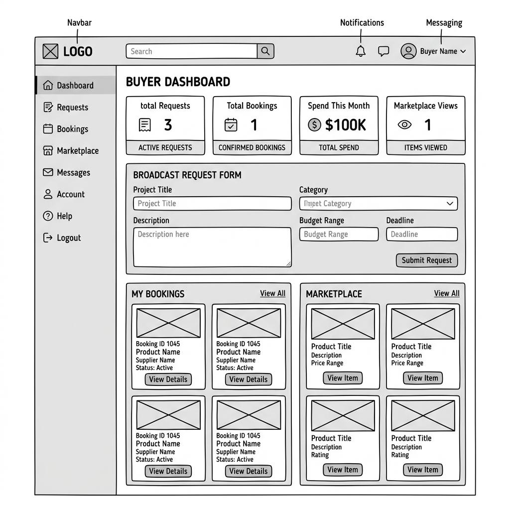
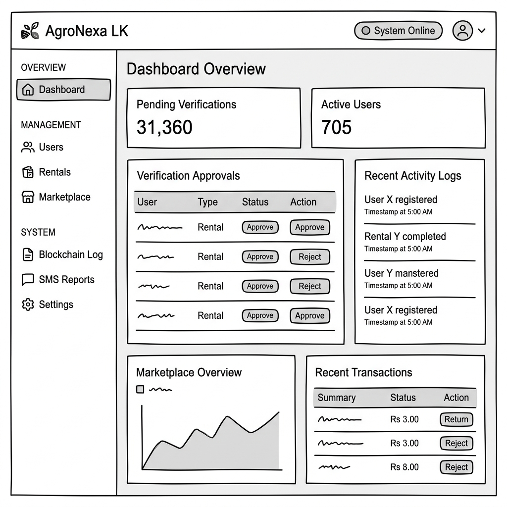

# CHAPTER 5 – SYSTEM IMPLEMENTATION

## 5.1 Introduction

This chapter details the system implementation of the **AgroNexa LK Smart Farming Platform**. It describes the programming languages, software frameworks, tools, database integrations, security services, and deployment pipelines used to build the production system.

The platform has been implemented with a focus on usability, real-time communications, secure transaction tracking via an immutable ledger, and multi-user role management. The chapter presents implementation logic, data structures, and code snippets from key system modules to document the technical implementation.

---

## 5.2 Development Technologies

The system is built on a modern, decoupled web application stack:

*   **Programming Language**: JavaScript (ES6+) and TypeScript (v5) are used across the stack, providing unified language support from backend databases to client views.
*   **Frontend Framework**: React.js bootstrapped with Vite, utilizing Tailwind CSS for a premium, responsive user interface.
*   **Backend Server**: Node.js utilizing the Express.js framework for routing, controllers, and middleware management.
*   **Database Management**: PostgreSQL, a highly reliable relational database, managed via SQL schema migrations and connection pooling.
*   **Real-time Communication**: Socket.IO is integrated into the Express server and React client to support instant live messaging.
*   **Asset Cloud Storage**: Cloudinary is used to host uploaded user NIC verification cards, profile photos, and crop listing images.
*   **SMS & OTP Gateway**: Twilio API services are used to perform phone-number verification and notify users of system actions.

---

## 5.3 Frontend Implementation

The frontend of the AgroNexa LK platform is implemented using a hybrid architecture. The customer-facing marketing and authentication gates (landing, login, registration, and administrative verification pages) are built using highly responsive HTML5/CSS3 pages with raw JavaScript logic for fast page loads and search engine visibility. The interactive user workspace dashboards are implemented as a React.js single-page application (SPA) managed via Vite, allowing dynamic user role transitions.

### 5.3.1 Landing & Login Page
The landing page and login panel share a unified interface (`index.html`) using a premium, split two-panel layout to handle incoming traffic and welcome returning users.
*   **Visual Layout Structure**: The screen is split into a brand introduction panel on the left (containing the circular logo placeholder, hero tagline, platform stats, and system status pulse indicator) and an authentication form wrapper on the right.
*   **Form Functionality**: The login form contains inputs for Email Address and Password with dynamic status borders (turning green for valid patterns or red with error popups on validation failure), password visibility togglers, and a Google OAuth action trigger.

**Figure 5.1: Landing & Login Page Layout Screenshot**


---

### 5.3.2 Registration Page
The registration module utilizes a dynamic card switcher that updates input requirements based on the user's role.
*   **Buyer Selection Layout**: Collects basic information including Full Name, Email, Phone Number, location district, and password details.
*   **Farmer Selection Layout**: Appends physical address inputs, National Identity Card (NIC) text entries, and two interactive drag-and-drop file upload boxes (for NIC front and back image files) using the FileReader API.
*   **Verification and Confirmation**: Both views require entering the 6-digit verification OTP sent via SMS and render a confirmation modal summarizing entered data before submission.

**Figure 5.2: Buyer Registration Layout Screenshot**


**Figure 5.3: Farmer / Seller Registration Layout Screenshot**


---

### 5.3.3 Farmer / Seller Dashboard
The Farmer Dashboard acts as the central hub for agricultural producers to manage their sales, listings, and equipment bookings.
*   **Dashboard Grid Layout**: Contains a left-side navigation sidebar (displaying the brand logo and active user profile details) and a main content grid.
*   **Control Panel Components**: Incorporates top row statistics blocks (crops listed, incoming schedules, active ledger receipt counts, reputation rating), a sales performance graph container, an active listing table manager, and listing requests.

**Figure 5.4: Farmer / Seller Dashboard Layout Screenshot**


---

### 5.3.4 Buyer Dashboard
The Buyer Dashboard is customized for procurement managers and buyers.
*   **Purchasing Controls**: Features a left navigation bar, notification center indicators, and stats overview tiles.
*   **Marketplace & Broadcast Panels**: Renders the crop marketplace directory card list (complete with local search bars and district dropdown filters) alongside a crop broadcast request form and previous bookings ledger logs.

**Figure 5.5: Buyer Dashboard Layout Screenshot**


---

### 5.3.5 Admin Dashboard
The Admin Dashboard is the management hub for administrative staff.
*   **Approval & Audit Panels**: Includes verification logs, user accounts manager, and statistics summaries.
*   **KYC Approval Window**: Displays pending farmers alongside side-by-side viewports rendering the uploaded NIC front and back cards for immediate manual inspection, approval, or rejection.
*   **Ledger Verification Console**: Features a security ledger console to check blockchain block integrity and highlight modified records.

**Figure 5.6: Admin Dashboard Layout Screenshot**


---

## 5.4 Backend Implementation

The backend is built as an Express.js server in Node.js. It handles routes routing, REST controllers operations, background service utilities, and Socket.IO real-time event triggers.

---

## 5.5 Code Structure (Brief Explanation)

The AgroNexa LK project utilizes a modular directory and folder structure to enhance maintainability and support future scalability.

```
agronexa-lk/ (Root Folder)
│
├── backend/                  # Backend Node.js / Express application directory
│   └── src/
│       ├── config/           # Database configuration and connection pool setup
│       ├── controllers/      # Business logic controllers (auth, crops, bookings)
│       ├── middlewares/      # Security filters (JWT auth, RBAC authorization)
│       ├── routes/           # REST endpoints mapping routers
│       ├── services/         # Integrations (Twilio SMS, Ledger hashing, Audit logs)
│       ├── socket/           # WebSocket real-time live chat controllers
│       ├── app.js            # Express app middleware and router bootstrapper
│       └── server.js         # Backend server startup listener entrypoint
│
├── frontend/                 # Client React.js / Vite dashboard SPA directory
│   └── src/
│       ├── data/             # Dashboard mock testing datasets (buyer/seller dummy data)
│       ├── pages/            # Dashboard workspace view screens (Buyer & Seller)
│       ├── shared/           # Reusable visual views (charts, sidebar layouts, ui badges)
│       ├── styles/           # Tailwind CSS configuration and themes settings
│       ├── utils/            # Shared client utility files (Tailwind class merger)
│       ├── App.tsx           # React router component setting paths
│       └── main.tsx          # Client virtual DOM React mounting entrypoint
│
├── diagrams/                 # Project architecture UML and wireframe PNG files
├── uploads/
│   └── nic/                  # Target storage folder for KYC NIC document uploads
│
├── index.html                # Entry Gateway (Landing page, login panels, registrations)
├── buyer.html                # Corporate Buyer Dashboard static template
├── seller.html               # Farmer / Seller Dashboard static template
├── admin.html                # Administrator Panel view static template
├── translations.js           # Multi-language dictionary files (Sinhala / Tamil / English)
├── server.js                 # Root entrypoint redirecting executions to backend
└── package.json              # Main project configuration and dependencies registry
```

#### Explanation of Key Directories and Files:
*   **backend/src/** – Houses the Express server logic. It manages configuration credentials, database mapping models, request controllers, routes, middlewares, services, and real-time Socket.IO components.
*   **frontend/src/** – Houses the React single page application. It defines visual widgets, workspace layouts, local mock databases, styling assets, utility connectors, and routes.
*   **diagrams/** – Contains system diagrams and low-fidelity interface wireframe PNGs.
*   **uploads/nic/** – Local storage destination for multipart NIC front/back files upload.
*   **index.html, buyer.html, seller.html, admin.html** – Serve as client interface templates providing auth gates, client dashboards, and administrative controls.
*   **translations.js** – Declares dictionary string mapping sets for localization settings.
*   **server.js (Root)** – Serves as a bootloader to launch the backend application when running hosting workflows.

---

## 5.6 Database Implementation

The relational database is implemented in PostgreSQL. Database initializations and updates are managed programmatically via `config/db.js`. 

Connection pooling is implemented using the `pg` driver’s `Pool` object, which limits resource consumption while handling parallel requests under heavy traffic. High-frequency queries (e.g. crop listings filtering, message logging) are optimized with primary/foreign keys which create index tables implicitly.

---

## 5.7 Authentication and Authorization

### 5.7.1 OTP Verification
The platform implements two-factor authentication (2FA) via Twilio Verify Services. When registering or changing contact details, a 6-digit OTP code is sent to the normalized E.164 phone number. 

The Twilio client normalization translates local numbers (e.g., `0771234567`) to international format (`+94771234567`) before executing the SMS dispatch. Below is the twilio verification service logic:

```javascript
// From backend/src/services/twilio.service.js
async function sendOtp(phone) {
  const e164 = normalizePhoneToE164(phone);
  if (!e164) throw new Error('Invalid phone format.');

  const client = getTwilioClient();
  const verifySid = process.env.TWILIO_VERIFY_SID;

  // Fallback to developer mock mode if Twilio is not configured in env
  if (!client || !verifySid) {
    console.warn(`⚠️ Twilio not configured. Mocking OTP send to ${e164}`);
    return { success: true, mock: true, message: 'OTP sent (Mock mode). Use code 123456 to verify.' };
  }

  await client.verify.v2.services(verifySid).verifications.create({ to: e164, channel: 'sms' });
  return { success: true, mock: false, message: 'OTP sent successfully.' };
}
```

### 5.7.2 Password Encryption
Passwords are never stored in plain text. When a user submits registration data, the backend controller generates a salt and hashes the password using **BCrypt** with 10 salt rounds. During login, the submitted plain-text password is compared against the hashed string stored in the `users` table:

```javascript
// Password Hashing on Register
const bcrypt = require('bcrypt');
const passwordHash = await bcrypt.hash(password, 10);

// Password Comparison on Login
const isMatch = await bcrypt.compare(submittedPassword, user.password_hash);
```

### 5.7.3 JWT Authentication
After successful password and OTP verification, the backend generates a JSON Web Token (JWT) signed with the server's private key (`JWT_SECRET`). The token includes the user’s ID, email, role, and first name. The client stores this token and passes it in the `Authorization: Bearer <token>` header for subsequent requests.

### 5.7.4 Role-Based Access Control
Access to specific endpoints is protected by a customized hybrid authentication middleware. It validates JWT tokens and provides a database query fallback for backward compatibility with legacy frontends, followed by a role validation handler (`requireRole`):

```javascript
// From backend/src/middlewares/auth.middleware.js
async function authRequired(req, res, next) {
  try {
    const header = req.headers.authorization || '';
    const token = header.startsWith('Bearer ') ? header.slice('Bearer '.length) : null;

    if (token) {
      const decoded = jwt.verify(token, JWT_SECRET);
      req.auth = decoded;
      return next();
    }

    // Hybrid fallback for compatibility with existing HTML files
    const userId = req.query.seller_id || req.query.buyer_id || req.query.user_id;
    if (userId) {
      const result = await db.query('SELECT id, email, role, first_name, status FROM users WHERE id = $1', [userId]);
      if (result.rows.length > 0) {
        const user = result.rows[0];
        if (user.status === 'pending') {
          return res.status(403).json({ error: 'Your account is pending admin approval.' });
        }
        req.auth = { id: user.id, email: user.email, role: user.role, name: user.first_name };
        return next();
      }
    }
    return res.status(401).json({ error: 'Authentication required.' });
  } catch (e) {
    return res.status(401).json({ error: 'Invalid or expired auth token.' });
  }
}

// Role Validation Middleware
function requireRole(roles = []) {
  const allowed = Array.isArray(roles) ? roles : [roles];
  const normalizedAllowed = allowed.map(r => r === 'farmer' ? 'seller' : r);

  return (req, res, next) => {
    if (!req.auth) return res.status(401).json({ error: 'Unauthorized' });
    const userRole = req.auth.role === 'farmer' ? 'seller' : req.auth.role;

    if (!normalizedAllowed.includes(userRole)) {
      return res.status(403).json({ error: 'Forbidden. Access restricted.' });
    }
    return next();
  };
}
```

---

## 5.8 KYC Verification Module

The KYC (Know Your Customer) module enforces trust and safety:
1.  **File Upload**: Farmers must upload images of the front and back of their National Identity Card (NIC).
2.  **Multer Middleware**: Processes raw file uploads on the Express server and parses multipart form data.
3.  **Cloud Storage**: The images are stored in Cloudinary, returning secure URLs.
4.  **Admin Review**: A dedicated Admin panel renders the pending users with links to view their uploaded cards. Admins can click "Approve" (setting status to `active`) or "Reject" (requiring a text reason).

---

## 5.9 Crop Marketplace Module

The Crop Marketplace allows farmers to list products and buyers to place orders.
*   **Listings**: Stored in the `crop_listings` table. Contains fields for category, quantity in kilograms, price per kilogram, and location (district).
*   **Filtering**: High-performance query filters allow users to query crop listings by category, district, and availability date range.
*   **Orders**: When a buyer submits an order, it decreases the available `quantity_kg` of the listing and inserts a tracking record into the `crop_orders` table.

---

## 5.10 Equipment Rental Module

The Equipment Rental module enables shared mechanics usage. 
*   Farmers list machinery (e.g. Tractors, Harvesters) in `equipment_listings`.
*   Buyers request bookings with `start_date` and `end_date`.
*   The system checks database overlapping bookings using SQL range checks:
    ```sql
    SELECT * FROM equipment_bookings 
    WHERE listing_id = $1 
      AND status = 'confirmed'
      AND (start_date <= $3 AND end_date >= $2)
    ```
*   Upon owner acceptance, the ledger is triggered, generating a cryptographic block for the transaction.

---

## 5.11 Broadcast Request Module

If buyers need large quantities of a crop, they create a **Broadcast Request** in the system:
1.  The buyer specifies crop type, quantity range, delivery district, needed-by date, and contact links (Email, WhatsApp, Phone).
2.  The request is published and indexed in the `buyer_requests` table.
3.  Farmers view local requests, filtering them by district, and submit **Farmer Responses** containing their price quotes, message details, and capacity.

---

## 5.12 Live Chat Module

Real-time negotiation is implemented using **Socket.IO** over WebSockets, bypassing traditional slow HTTP polling.
*   **Server Handler**: Socket.IO connects to the Express HTTP instance, mapping socket client connections to authenticated user IDs.
*   **Message Events**: When client triggers `send_message`, the server writes the text (and optional attachment url) to `direct_messages` in PostgreSQL, then broadcasts a `receive_message` payload directly to the recipient's active socket.
*   **Online Presence**: Monitors user connect/disconnect states to show live online statuses.

---

## 5.13 Notification System

The notification module ensures that users respond quickly to updates:
*   **Trigger Events**: Triggers when a buyer requests equipment rental, a seller confirms a booking, an admin approves KYC, or a new broadcast response is submitted.
*   **Socket.IO Broadcast**: Fires a real-time event so users see instant notifications while active on the dashboard.
*   **SMS Notification**: If the user has `sms_notifications` enabled, the backend calls the Twilio service to deliver a summary text message directly to their phone.

---

## 5.14 Cryptographic Ledger Implementation

The system implements a blockchain-inspired immutable ledger to store equipment rental agreements and transaction receipts. This ensures database records cannot be silently modified without breaking the chain's integrity.

```javascript
// From backend/src/services/ledger.service.js
const crypto = require('crypto');
const db = require('../config/db');

function hashRecord(record, prevHash) {
  const data = JSON.stringify(record) + prevHash;
  return crypto.createHash('sha256').update(data).digest('hex');
}

async function writeLedgerEntry(listingId, listingType, renterId, ownerId, amount, durationDays) {
  // 1. Get previous block's hash
  const lastEntry = await db.query(
    `SELECT block_hash FROM rental_ledger ORDER BY id DESC LIMIT 1`
  );
  const prevHash = lastEntry.rows.length ? lastEntry.rows[0].block_hash : '0';

  // 2. Setup transaction details
  const txId = crypto.randomUUID().replace(/-/g, '');
  const recordData = {
    txId,
    listingId,
    renterId,
    ownerId,
    amount: parseFloat(amount),
    days: parseInt(durationDays, 10),
  };

  // 3. Compute block hash and agreement hash
  const blockHash = hashRecord(recordData, prevHash);
  const agreementText = `AGREEMENT: TX_ID=${txId} LISTING_ID=${listingId} RENTER_ID=${renterId} OWNER_ID=${ownerId} AMOUNT=${parseFloat(amount).toFixed(2)} DURATION=${parseInt(durationDays, 10)}`;
  const agreementHash = crypto.createHash('sha256').update(agreementText).digest('hex');

  // 4. Write to DB
  const result = await db.query(
    `INSERT INTO rental_ledger 
       (tx_id, listing_id, listing_type, renter_id, owner_id, amount, duration_days, prev_hash, block_hash, agreement_hash)
     VALUES ($1, $2, $3, $4, $5, $6, $7, $8, $9, $10)
     RETURNING *`,
    [txId, listingId, listingType, renterId, ownerId, amount, durationDays, prevHash, blockHash, agreementHash]
  );

  return result.rows[0];
}
```

This ledger is validated programmatically. If any table entry is modified, a comparison of the calculated hash against `block_hash` and `agreement_hash` fails, triggering a security alert on the Admin panel.

---

## 5.15 Audit Logging

The platform keeps track of administrative actions and authentication updates.
When administrative actions are triggered (e.g. KYC approval, user lockout, database clearing), the backend invokes the `AuditService` to write a log entry into the `audit_logs` table containing:
*   User ID of the initiator
*   Action name (e.g., `APPROVE_KYC`, `USER_LOGIN_FAILED`)
*   IP Address of the client
*   JSON Details describing the context of the action

---

## 5.16 System Deployment

### 5.16.1 Frontend Deployment (Vercel)
The React client build output (minified HTML, JS, CSS) is deployed on **Vercel**. Production environment variables link the client routes to the deployed railway backend endpoint.

### 5.16.2 Backend Deployment (Railway)
The Express backend is hosted on **Railway**, which connects to GitHub to compile and deploy updates automatically on push events. The service runs in a secure Node runtime sandbox.

### 5.16.3 Database Hosting (Railway PostgreSQL)
The PostgreSQL database runs on a managed Railway database node. It executes periodic backups and enforces SSL-encrypted connections.

### 5.16.4 Cloudinary Integration
For dynamic image uploads, the backend controller maps requests to Cloudinary storage buckets. The API keys are loaded via server-side environment variables, ensuring secrets are never exposed on client browsers.

### 5.16.5 GitHub Version Control
All code commits and updates are tracked in a secure GitHub repository. Git branches are used to separate development tasks, merging updates to the main production branch only after local manual testing has passed.
